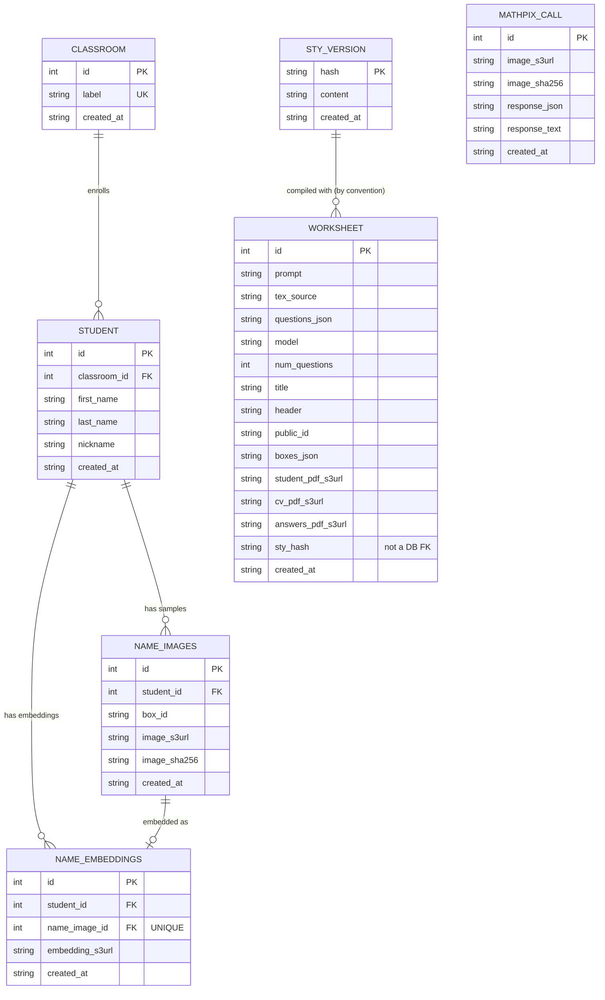

# Description
GraderBot is a code-base for generating arithmetic worksheets that can be auto-graded.  Worksheets are generated in latex in two modes: `cv mode=true` or `cv mode=false`.  See `tex/demo.tex` for reference.

The LaTeX sources (`gbworksheet.sty`, `questions.sty`, the templates, and the
generated `aruco_images/` markers) live in the `tex/` directory. Compile from
there:
```
cd tex && latexmk -pdf demo.tex
```

To clean the directory run
```
cd tex && latexmk -c demo.tex
```

or use `-C` if you also want the `.pdf` file removed.

## CV mode
If you would like to control the value of `cv mode` from the command line at compilation time then do
```shell
cd tex && latexmk -pdf -usepretex='\def\WSCVMode{0}' demo.tex 
```
for `cv mode = false`.  For `cv mode = true` just change the 0 into a 1 in the above command.


## Sythesizing Student Work
The [worksheet_synth](./graderbot/worksheet_synth.py) python module is for making synthetic images of student work.  It can compile latex, fill in answer boxes, and add noise and perspective skewing.  This is primarily useful for making unit-tests for grader bot, which is concerned primarily with inverting the `worksheet_synth` module.  Here is an example code-snippet

```python
import cv2
from graderbot.worksheet_synth import fill_worksheet, perspective_skew_image, add_image_noise
import numpy as np

# fill_worksheet returns one BGR image per page (a worksheet may span
# several pages), so index/iterate the list.
pages = fill_worksheet('tex/demo.tex', {'add001': '12', 'sub001': r'\frac{3}{5}'})
skewed = perspective_skew_image(pages[0], max_skew=0.02, rng=np.random.default_rng(42))
noisy = add_image_noise(skewed, noise_level=0.05, rng=np.random.default_rng(7))
cv2.imwrite('output_filename.png', noisy)
```

## Worksheet storage (S3 + SQLite)
The [worksheetbot](./graderbot/worksheetbot.py) pipeline can upload the generated PDFs
(student/blank, cv, and answer key) to S3 and record them, along with the
`.tex` source and question JSON, in a SQLite database via
[storage.py](./graderbot/storage.py). This is opt-in: pass `--bucket` (or set the
`S3_BUCKET` env var) when running `python -m graderbot.worksheetbot`. If no bucket is
configured, the worksheet is still compiled but nothing is uploaded or
stored.

### Schema (ERD)
All six tables live in the one SQLite DB created by `init_db` (`storage.py`).
`CLASSROOM`/`STUDENT`/`NAME_IMAGES`/`NAME_EMBEDDINGS` form the roster/name-classifier
chain (issues #2/#43/#46); `WORKSHEET`, `STY_VERSION`, and `MATHPIX_CALL` are
standalone. The `WORKSHEET.sty_hash -> STY_VERSION.hash` link is a convention
followed in code (`record_sty_version`), not a SQLite `FOREIGN KEY` constraint.



### System dependencies
Beyond the Python packages (managed with poetry), grading and worksheet
compilation shell out to native binaries that must be on your `PATH`:
- **Tesseract** — `pytesseract` (used by [graderbot/ocr.py](./graderbot/ocr.py)
  to read the student-name box) is only a wrapper around the `tesseract`
  binary. Install it with `brew install tesseract` on macOS or
  `apt-get install tesseract-ocr` on Debian/Ubuntu. The `Dockerfile` installs
  it for the deployed image.
- **TeX Live / latexmk** — for compiling the worksheet templates (see above).

### One-time setup
1. Create an S3 bucket for PDF + database backups.
2. Create an IAM user/role with an S3 policy scoped to that bucket. This
   repo's code only needs `s3:PutObject`/`s3:GetObject`, but litestream also
   needs `s3:GetBucketLocation`/`s3:ListBucket` (bucket-level) and
   `s3:DeleteObject`/`s3:ListMultipartUploadParts`/`s3:AbortMultipartUpload`
   (object-level) for replication and retention. Example policy:
   ```json
   {
       "Version": "2012-10-17",
       "Statement": [
           {
               "Sid": "BucketLevel",
               "Effect": "Allow",
               "Action": ["s3:GetBucketLocation", "s3:ListBucket"],
               "Resource": "arn:aws:s3:::<your-bucket-name>"
           },
           {
               "Sid": "ObjectLevel",
               "Effect": "Allow",
               "Action": [
                   "s3:PutObject",
                   "s3:GetObject",
                   "s3:DeleteObject",
                   "s3:ListMultipartUploadParts",
                   "s3:AbortMultipartUpload"
               ],
               "Resource": "arn:aws:s3:::<your-bucket-name>/*"
           }
       ]
   }
   ```
3. Add the following to `.env`:
   ```
   S3_BUCKET=<your-bucket-name>
   AWS_ACCESS_KEY_ID=<...>
   AWS_SECRET_ACCESS_KEY=<...>
   AWS_REGION=<...>
   WORKSHEETS_DB_PATH=worksheets.sqlite3
   BASE_URL=https://grader-bot.fly.dev
   ```
   `litestream.yml` reads its DB path from `WORKSHEETS_DB_PATH`, so this must
   be set (and match the path used by `graderbot/app.py` / `graderbot.worksheetbot`) for
   replication to point at the right file.

   `BASE_URL` is optional (defaults to `https://grader-bot.fly.dev`) and is only
   used to build the permanent `?dl=<public_id>` download links shown in the
   Gallery tab for each worksheet's student PDF (see `graderbot/app.py`'s
   `build_permanent_download_url`). Set it explicitly in production (already
   done in `fly.toml`) so it stays correct if the app's domain ever changes.
   (The `graderbot` package is imported top-level, so run tests and scripts from
   the repo root — `pytest` picks up `pythonpath = ["."]` automatically, and for
   ad-hoc runs use `python -m graderbot.<module>` or set `PYTHONPATH=.`.)

### Backups
The SQLite database (`worksheets.sqlite3` by default) is meant to be
continuously replicated to S3 with [litestream](https://litestream.io/),
using the config in [litestream.yml](./litestream.yml). Litestream itself
runs as an external process; this repo's code only writes to the local
SQLite file in WAL mode (required for litestream) and does not start or
manage the litestream process.

Install litestream locally with:
```shell
brew install benbjohnson/litestream/litestream
```

`litestream.yml` references `${S3_BUCKET}`, so export `.env` before starting
replication. Start it manually, once per development session, in its own
terminal (or backgrounded), before running `python -m graderbot.worksheetbot` or
`streamlit run graderbot/app.py`:
```shell
set -a; source .env; set +a
litestream replicate -config litestream.yml
```

### Mathpix OCR logging
To build a labelled dataset for a future in-house OCR model (issue #1), every
Mathpix call made by `read_box` can be logged: the exact PNG posted to Mathpix
is stored in S3 (content-addressed as `mathpix/<sha256>.png`) and a
`MATHPIX_CALL` row (image URL, image hash, raw Mathpix response JSON, and parsed
answer text) is written to the SQLite DB. This is opt-in and self-gating: it
does nothing unless a bucket is configured via `MATHPIX_LOG_BUCKET` (falling
back to `S3_BUCKET`), and it reuses `WORKSHEETS_DB_PATH` for the database.
Logging failures are non-fatal — they never interrupt OCR or grading. Set in
`.env`:
```
MATHPIX_LOG_BUCKET=<your-bucket-name>   # optional; defaults to S3_BUCKET
```

### Answer OCR: Mathpix vs EasyOCR vs Google Cloud Vision
Answer boxes are read by Mathpix by default (`graderbot/ocr.py`), which
handles handwritten LaTeX fractions well but is tuned for college-level math
and occasionally misreads a sloppy digit (issue #70: "9" as "G", "14" as
"1 h"). The Grade tab's "Read answers with" dropdown can switch a run to
EasyOCR or Google Cloud Vision instead — by default neither reads fractions,
so stick with Mathpix for worksheets that have them:
- **EasyOCR** is restricted to a character allowlist (default `0123456789.`,
  widened per run from the same dropdown, e.g. append `xy` for an algebra
  worksheet). It also has an experimental "Try to detect fractions" checkbox
  (off by default): `_detect_fraction_bar` looks for a single long
  horizontal ink stroke spanning most of the box's width with OpenCV, and if
  found, splits the crop and OCRs the numerator/denominator separately
  instead of the whole box at once. It's opt-in because a false-positive bar
  detection on ordinary sloppy handwriting -- the exact problem domain here
  -- would silently misread a plain answer; only turn it on for a worksheet
  that actually has fraction questions.
- **Google Cloud Vision** uses `DOCUMENT_TEXT_DETECTION` (Google's mode for
  dense/handwritten text) with no allowlist support and no fraction-splitting.

`graderbot/answer_reader.py`'s three `AnswerReader`s (`MathpixAnswerReader`,
`EasyOcrAnswerReader`, `GoogleVisionAnswerReader`) mirror the existing
`NameReader` pattern used for student identification.

**EasyOCR** runs as a **separate sidecar service** (`easyocr_service/`)
rather than a `graderbot` dependency: its only real dependency, torch, ships
no wheel for Intel Mac and is heavy to bundle into the main deploy image.
Two ways to run it, same image contents either way:

*Locally*, via Docker:
```shell
docker compose up -d easyocr
```
then set in `.env`:
```
EASYOCR_SERVICE_URL=http://localhost:8080
```
Its own tests (`easyocr_service/test_main.py`) run inside the container, not
via the main `poetry run pytest` (fastapi/easyocr/torch are deliberately not
in this project's venv):
```shell
docker compose build easyocr
docker compose run --rm easyocr pytest -q
```

*Deployed*, on [Modal](https://modal.com) — this is how anything other than
your own laptop (e.g. the fly.io-hosted app) reaches it. One-time setup:
```shell
poetry run modal setup                                    # browser auth, once per machine

# Generate the key into a local shell variable so you can reuse the exact
# same value below -- `modal secret create` only sends it to Modal, it
# doesn't print it back out or save it anywhere for you.
EASYOCR_API_KEY=$(openssl rand -hex 32)
echo "$EASYOCR_API_KEY"                                    # copy this -- you need it again below
poetry run modal secret create easyocr-api-key EASYOCR_API_KEY=$EASYOCR_API_KEY
```
Then deploy (and redeploy after any `easyocr_service/` change):
```shell
poetry run modal deploy easyocr_service/modal_app.py
```
This prints a URL ending in `-web.modal.run`. Set both of these in `.env`
(and wherever the Streamlit app itself runs) — `EASYOCR_API_KEY` must be the
*same* value you just gave `modal secret create`, not a new one:
```
EASYOCR_SERVICE_URL=<the printed *.modal.run URL>
EASYOCR_API_KEY=<the value echoed above>
```
Unlike a `localhost` URL, the Modal URL is public, so `main.py` rejects any
`/ocr` request that doesn't echo `EASYOCR_API_KEY` back as an `X-Api-Key`
header once that secret is present in its environment — the local
docker-compose container never gets this secret, so local dev is unaffected
and needs no key at all. `EasyOcrAnswerReader` raises a clear error (same
failure mode as a missing Mathpix key) if `EASYOCR_SERVICE_URL` isn't set;
`EASYOCR_API_KEY` is optional and simply omitted from the request if unset.

Model weights (~70MB) are cached in a Modal `Volume` (`easyocr-models`) so
only the first request after a cold start pays the download; `_get_reader`
still defers loading them into memory until the first `/ocr` call either way.

**Google Cloud Vision**, unlike EasyOCR, needs no sidecar and no new Python
dependency — `GoogleVisionAnswerReader` calls the Vision REST API directly
with `requests`, the same shape as the Mathpix call. Set in `.env`:
```
GOOGLE_VISION_API_KEY=<your-api-key>
```
(from a GCP project with the Cloud Vision API enabled — see
https://cloud.google.com/vision/docs/setup). Works on fly.io as-is, since
it's a plain HTTPS call.

### Answer verification: CNN verifier (experimental, issue #81)
All three backends above transcribe a crop open-vocabulary, with no idea
what a middle-school worksheet's answer is even supposed to look like. The
"CNN verifier (experimental)" option in the Grade tab's "Read answers with"
dropdown instead **verifies** a crop against the known answer plus a
handful of OCR-confusable near-misses (`graderbot/response_candidates.py`),
using a small CRNN trained from scratch on this project's own domain
(digits, `.`, `-`) rather than a general-purpose alphabet — directly
targeting the kind of confusion (e.g. "1" vs "/") a borrowed English-prose
model couldn't resolve (see the paused `handwriting-ctc-match` spike, issue
#73).

- **Scope (v1): plain numeric answers only** — integers, decimals,
  negatives. A `\frac{a}{b}` question on the same worksheet still falls
  back to Mathpix automatically; there's no need to switch dropdowns
  mid-worksheet.
- **Runs in-process**, unlike EasyOCR — its only dependency,
  `onnxruntime`, ships real wheels for both Intel macOS and fly.io (unlike
  torch), so `CnnResponseScorer` (`graderbot/response_scorer.py`) just
  loads `models/response_scorer/weights.onnx` off disk, no sidecar, no
  Modal deployment for inference.
- **Training is the part that needs Modal** — the CRNN itself is trained
  with torch (`training/`, isolated from the main project's
  `pyproject.toml` the same way `easyocr_service/` isolates EasyOCR's torch
  dependency), and this dev environment has no torch wheel available at
  all. Generate synthetic training crops with
  `graderbot/answer_glyph_synth.py`, train + export with:
  ```shell
  poetry run modal run training/modal_app.py --steps 20000
  ```
  which writes `models/response_scorer/{weights.onnx,vocab.json}` straight
  into the repo. `training/eval.py` reports per-answer-type accuracy on
  held-out synthetic data.
- **Real-data labeling, two ways**, both writing to the same
  `HANDWRITING_LABEL` table:
  - **Copy worksheets** (Handwriting Data tab, `graderbot/handwriting_sample_worksheets.py`
    + `graderbot/handwriting_harvest.py`) — the preferred path. Generates an
    ordinary worksheet where each box already prints its own answer, so the
    student only copies it by hand; the printed text *is* the ground truth,
    so every scanned-back box becomes a trustworthy label with **no manual
    review**. This is real student handwriting captured through the normal
    scan/registration pipeline, not synthetic-font renders or a borrowed
    dataset like MNIST (isolated digits, no `.`/`-`, no multi-character
    sequences, no box-crop realism).
  - `scripts/label_handwriting.py` walks unreviewed `MATHPIX_CALL` crops one
    at a time (seeded from Mathpix's own guess) and records a
    confirmed/corrected label — useful for labeling *existing* scans of
    real graded worksheets, where a human's review is still the source of
    truth.

  Either way, real labels are the ground truth a synthetic-only model needs
  checked against before being trusted (the gap that sank the `pylaia-iam`
  spike). Until a real-data eval exists, the Grade tab option stays labeled
  "(experimental)".

### Handwriting name classifier
Students are identified on a scanned worksheet either by OCR'ing the name box
or by recognizing their handwriting. The handwriting path (issue #2) runs
end to end through the Streamlit app:

1. **Name sheets** tab — print one name-collection page per student.
2. **Roster** tab — upload the scanned sheets. `ingest_name_sheets` crops each
   handwriting sample to S3 + the `NAME_IMAGES` table, then `vectorize_samples`
   embeds each crop into `NAME_EMBEDDINGS`.
3. **Visualize** tab — "Evaluate classifier" runs leave-one-out
   cross-validation per student (worth checking before trusting it), and
   "Train classifier" fits the model and saves it to
   `name_classifier/<classroom id>.joblib` in S3. **Retrain after ingesting new
   name sheets** — the saved model does not update on its own.
4. **Grade** tab — the "Read student names with" dropdown picks between the
   trained classifier and OCR for that run, and the results table shows which
   name was read off each page and how confident the reader was, so a doubtful
   read can be checked by hand (issue #58).

`vectorize_samples` (see [embedding.py](./graderbot/embedding.py)) chooses its
embedder from the `NAME_EMBEDDER` env var:
- `voyage` (the default) — `RemoteEmbedder` calls the
  [Voyage multimodal-3](https://www.voyageai.com/) embedding API, chosen over
  self-hosting so no heavyweight (torch) service needs deploying. It scored a
  perfect leave-one-out accuracy on a small real roster versus ~0.56 for raw
  pixels (issue #56). Requires `VOYAGE_API_KEY`.
- `local` — `LocalEmbedder`, a lightweight in-process resize+flatten embedder
  with no API key, for offline use.

```
VOYAGE_API_KEY=<your-voyage-api-key>
NAME_EMBEDDER=voyage   # optional; `voyage` (default) or `local`
```

Embedders produce different-sized vectors (Voyage 1024, `LocalEmbedder` 4096),
and a stored vector records no embedder of its own. Training and the Visualize
tab therefore keep only the vectors matching the *current* embedder's
dimension and report how many they skipped — so switching `NAME_EMBEDDER`
without re-ingesting silently shrinks the training set rather than mixing
incompatible vectors.

## Web frontend
[app.py](./graderbot/app.py) is a Streamlit app with six tabs: **Gallery**, to browse
previously created worksheets and open their student/cv/answer-key PDFs via
presigned S3 links; **Create**, to generate a new worksheet from a
prompt (runs the same pipeline as `graderbot.worksheetbot`, including S3 upload +
DB storage); **Grade**, to upload a PDF of scanned student work and have
it auto-graded; **Name sheets**, to paste a class roster (one name per line)
and download a printable PDF of name-collection worksheets — one page per
student (see [name_worksheets.py](./graderbot/name_worksheets.py) and issue #45);
**Roster**, to ingest those sheets back in and manage a class's students; and
**Visualize**, to inspect, cross-validate, and train the handwriting name
classifier (see above). Each graded page's QR code is matched to its stored
worksheet, graded
against the stored answer key (via `scan_grader.mark_scan`), and returned both
as per-student JSON results and as a single marked-up PDF (correct answers
written beside the wrong ones). It requires
`S3_BUCKET` and `ANTHROPIC_API_KEY` to be set (see
above); it reads/writes the same `worksheets.sqlite3` database as the CLI by
default (override with the `WORKSHEETS_DB_PATH` env var). Run it from the repo
root with:
```shell
streamlit run graderbot/app.py
```

## Fly.io
We currently deploy to fly.io at the url https://grader-bot.fly.dev

Deployment is automated: every push to the `main` branch triggers a deploy to
fly.io. To deploy, merge/push your changes to `main`. (You can still deploy
manually with `fly deploy` if needed.)

### Viewing logs
`fly logs -a grader-bot` streams recent logs. The app's own log lines are
prefixed `graderbot.app`; set `LOG_LEVEL=DEBUG` (fly secrets/env) for more
verbosity. Note the machine auto-suspends when idle (`auto_stop_machines`,
`min_machines_running = 0` in `fly.toml`), so live-tailing shows nothing until
a request wakes it — hit https://grader-bot.fly.dev first, or use `fly logs`
right after a deploy triggers a fresh machine start.